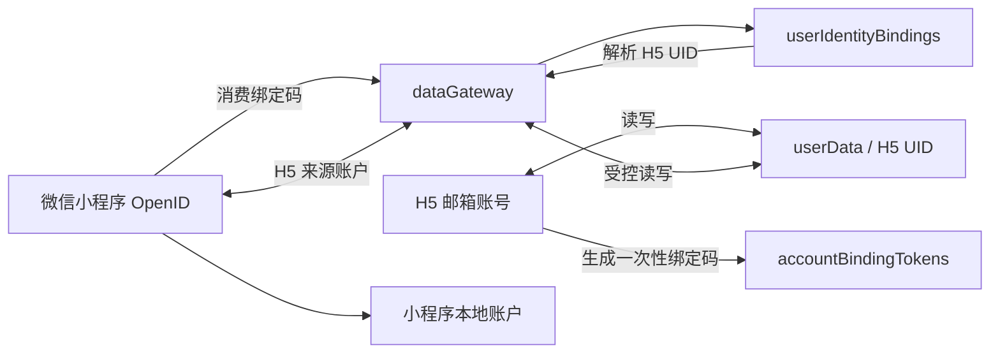

# H5 与微信小程序账号绑定及数据互通工作归档

归档日期：2026-07-16  
状态：已发布并完成主要人工验收

## 目标与边界

在不改变 H5 核心用户数据结构的前提下，让 H5 邮箱账号与微信小程序身份建立绑定，并让两端共有的投资账户数据双向互通。

- H5 账号以邮箱和密码登录，H5 用户 UID 是跨端数据的主身份。
- 小程序通过微信 OpenID 识别用户，不新增显式登录流程。
- H5 账户跨端同步；小程序本地账户默认仍只属于小程序。
- 用户可以将小程序本地账户迁移为 H5 账户，迁移后由两端共同读写。
- 两端独有字段保留在各自命名空间，不因同步被删除。

## 已完成内容

### 账号绑定与解绑

- H5“我的”页面为灰度用户提供“绑定微信小程序”入口。
- H5 登录用户可生成一次性绑定码；小程序输入绑定码后建立身份关系。
- 绑定码采用原子消费，不能重复使用；支持有效期校验。
- 两端均可识别当前绑定状态，小程序支持解绑。
- 已为“渔人”“渔人 test”和“阿木”开放测试权限。

### 账户模型与迁移

- 小程序账户按来源和账户 ID 分组展示，不再只按名称合并。
- H5 同步账户与小程序本地账户分开保存，同名账户不会互相覆盖。
- 账户数量限制按来源分别处理，避免 H5 账户占用小程序本地账户额度。
- 空 H5 账号绑定后，小程序可选择将本地账户迁移到 H5。
- 迁移保留小程序独有字段；共有字段转换为 H5 标准格式后写入 H5 用户文档。
- 修复迁移成功但 H5 文档缺失的问题，迁移写入使用确定性 H5 UID 文档 ID。

### 双向同步

- H5 修改 H5 账户后写入 `userData/{h5Uid}`，小程序读取后更新 H5 来源账户。
- 小程序修改 H5 来源账户后，通过 `dataGateway` 写回同一份 H5 用户文档。
- 小程序本地修改采用短延迟防抖上传；切后台、回前台和必要的页面生命周期会触发同步检查。
- H5 不再固定每 30 秒轮询；改为页面聚焦或重新可见时检查云端更新，减少请求量。
- 写入前比较云端版本，防止旧内存覆盖小程序刚写入的新数据。
- H5 云端文档使用 UID 作为确定性 `_id`，避免并发产生重复用户文档。

### 字段与板块兼容

- H5 字段和板块名称为跨端规范来源。
- 小程序“美股”统一映射为 H5“美股指数”。
- 已统一内置板块名称，同时保留用户自建板块。
- 发现页静态股票、用户手动添加股票和自选股票的板块在迁移时均保留。
- 修复小程序同步后 H5 美股指数不显示及发现页股票被过滤的问题。

### 浏览器账号隔离

- H5 同一浏览器切换账号时，业务快照和同步游标按 UID 分仓。
- 退出登录会归档当前账号数据并清空公共页面，防止下一账号看到前一账号数据。
- 首次同步两端均有数据时不会静默覆盖，保留冲突处理路径。
- 针对测试期间“阿木”账号受到旧浏览器缓存污染的问题，增加一次性定向清理并修复缺失旧账号标记时未清空内存的根因。

## 云端资源

CloudBase 环境：`vercel-dividend-d8faqegf03442b6c`

| 资源 | 用途 | 权限 |
| --- | --- | --- |
| `userData` | H5 用户投资数据；跨端文档 ID 为 H5 UID | 由现有 H5 权限和网关控制 |
| `accountBindingTokens` | 一次性绑定码、有效期和消费状态 | PRIVATE |
| `userIdentityBindings` | 微信 OpenID 与 H5 UID 的绑定关系 | PRIVATE |
| `dataGateway` 云函数 | 小程序绑定、解绑、读取、迁移和保存 H5 数据的受控入口 | 已部署 |

小程序已统一使用上述 CloudBase 环境，旧云环境不再参与此同步链路。

## 数据流

## 冲突与字段原则

1. 身份以 H5 UID 为主键，显示名称不参与数据归属判断。
2. 账户以来源和稳定账户 ID 区分，同名不等于同一账户。
3. H5 来源账户修改后写回 H5 文档；小程序本地账户不会自动上传。
4. 用户主动迁移本地账户后，该账户来源切换为 H5，并参与双向同步。
5. 两端共有字段按明确映射转换；未知或端侧专属字段应透传或保留，不做破坏性丢弃。
6. 云端较新时先拉取；只有本地存在明确更新游标时才允许覆盖云端。

## 验收结果

- 一次性绑定码生成、消费和绑定成功。
- 绑定码输入体验优化，输入框不再需要先删除长提示语。
- 解绑成功，绑定关系和状态正常清理。
- H5 账户在小程序正确显示，可切换和修改。
- 小程序修改 H5 来源账户后，H5 能读取更新。
- 小程序本地账户成功迁移到空 H5 账号，H5 能读取迁移数据。
- 多账户、同名账户和来源分组显示正常。
- “美股指数”、用户自建板块及用户自建标的正常保留。
- H5 发现页静态股票恢复且不影响用户自行添加的标的。
- 同浏览器切换 H5 账号不会再继承上一账号数据。
- 测试账号完成绑定、迁移、解绑、清理并重新测试，主流程可行。
- H5 最终回归测试：7 个测试文件、51 项测试全部通过，生产构建通过。

## 关键提交

### H5

- `477d4d5`：增加小程序账号绑定入口。
- `654612a`：保护跨设备账户同步。
- `f63251c`：用聚焦检查替代固定轮询。
- `1ccd1aa`、`980ad0b`、`f2c136f`：板块映射、发现页板块保留及 H5 规范化。
- `00b5c99`：H5 浏览器多账号隔离。
- `a476977`：保护确定性 H5 用户文档。
- `2f6d309`：可靠清理受污染的测试账号缓存。

### 微信小程序

- `2b78016`：增加 H5 账号绑定。
- `88d65d5`、`67313fc`：修复绑定写入并保证绑定码原子消费。
- `bc467b8`、`e5e8f6b`：跨端账户同步及来源分组展示。
- `4bf6301`：缩短同步延迟。
- `d521970`：小程序板块与 H5 对齐。
- `c223a15`：小程序本地账户迁移到空 H5。
- `8464409`：恢复缺失的 H5 迁移文档。

## 运维与排障

- 删除测试数据前必须先关闭对应账号的所有 H5 页面，否则旧页面可能通过自动同步重新写回。
- 清理时必须使用精确 H5 UID，不能按昵称或模糊查询删除。
- 出现“绑定成功但 H5 无数据”时，依次检查绑定关系、H5 UID、`userData/{h5Uid}` 和 `dataGateway` 日志。
- 出现板块不显示时，先检查规范化后的 `sector`，同时确认发现页静态数据没有被用户数据整体替换。
- `accountBindingTokens` 和 `userIdentityBindings` 必须保持 PRIVATE，客户端不得绕过 `dataGateway` 直接写入。

## 后续建议

- 将绑定入口从临时白名单逐步改为正式权限策略，并补充未登录状态的明确提示。
- 增加绑定码过期、重复消费、已绑定账号再次绑定等端到端自动化测试。
- 增加双端同时编辑同一账户时的用户可见冲突提示或字段级合并策略。
- 为 `dataGateway` 增加失败率、迁移次数和版本冲突监控。
- 观察一段时间后移除“阿木”账号的一次性缓存清理版本表，避免长期保留事故专用逻辑。

